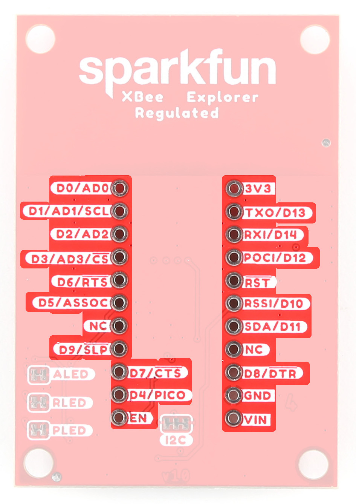

## XBee Smart Modem Socket

We've kept the XBee socket consistent with the XBee pinout, so this breakout board is backwards compatible. 

<figure markdown>
[{ width="400" }](assets/imgs/22032-SparkFun-XBee-Explorer-Regulated-XBeeSocket.jpg "Click to enlarge")
<figcaption markdown>XBeeSocket</figcaption>
</figure>

## Qwiic Connector

The Qwiic connector on the SparkFun XBee Regulated Board provides power and I2C connectivity to Qwiic breakout boards. Note that I2C functionality is not enabled by default. 

<figure markdown>
[{ width="400" }](assets/imgs/22032-SparkFun-XBee-Explorer-Regulated-QwiicConnex.jpg "Click to enlarge")
<figcaption markdown>Qwiic Connector</figcaption>
</figure>

## Buck Converter - AP63203

The AP63203 is a 2A, synchronous buck converter with a wide input voltage range that fully integrates a 125mΩ high-side power MOSFET and a 68mΩ lowside power MOSFET to provide high-efficiency step-down DC/DC conversion. VIN range is <b>3.8V-5.5V</b>. Output is 2A max. 

<figure markdown>
[{ width="400" }](assets/imgs/22032-SparkFun-XBee-Explorer-Regulated-BuckConverter.jpg "Click to enlarge")
<figcaption markdown>AP63203 Buck Converter</figcaption>
</figure>

## GPIO

We've broken out the XBee pins to plated through holes on either side of the board. 

<figure markdown>
[{ width="400" }](assets/imgs/22032-SparkFun-XBee-Explorer-Regulated-GPIO.jpg "Click to enlarge")
<figcaption markdown>GPIO</figcaption>
</figure>

## Buttons 

There are two buttons - D0 and RST. 

<figure markdown>
[{ width="400" }](assets/imgs/22032-SparkFun-XBee-Explorer-Regulated-Buttons.jpg "Click to enlarge")
<figcaption markdown>Reset and D0 Buttons</figcaption>
</figure>

## LEDs

There are three LEDs on the board: 

<figure markdown>
[{ width="400" }](assets/imgs/22032-SparkFun-XBee-Explorer-Regulated-LEDs.jpg "Click to enlarge")
<figcaption markdown>LEDs</figcaption>
</figure>

### PWR

Lights up when power is provided to the board. 

### ASC
The LED on the development board blinks when the XBee is registered to the cellular network.

| Blink | Timing | Meaning |
| --- | --- | --------- |
| On | Solid | Not joined to a mobile network |
| Double Blink | ½ second | The last TCP/UDP/SMS attempt failed. If the LED has this pattern, you may need to check DI (Remote Manager Indicator) or CI (Protocol/Connection Indication) for the cause of the error. | 
| Single blink | 1 Second | Normal Operation |

### RSSI 
Received Signal Strength Indicator - When configured, this LED reflects the received signal strength. 

RSSI PWM
The RSSI/PWM output is enabled continuously unlike other XBee products where the output is enabled for a short period of time after each received transmission. If running on the XBIB development board, DIO10 is connected to the RSSI LEDs, which may be interpreted as follows:

| PWM duty cycle | Number of LEDs turned on | Received signal strength (dBm) |
| --- | --- | --------- |
| 79.39% or more | 3 | 83 dBm or higher |
| 62.42% to 79.39% | 2 | -93 to -83 dBm |
| 45.45% to 62.42% | 1 | -103 to -93 dBm |
| Less than 45.45% | 0 | Less than -103 dBm, or no cellular network connection |

## Jumpers

### ALED/PLED/RLED

If power consumption is an issue (or if you just don't like the LEDs), cut the respective jumper to sever power to the LED. 

* PLED: Red
* ALED: Blue
* RLED (RSSI): Yellow

<figure markdown>
[{ width="400" }](assets/imgs/22032-SparkFun-XBee-Explorer-Regulated-LEDJumpers.jpg "Click to enlarge")
<figcaption markdown>LED Jumpers</figcaption>
</figure>

### I2C 

The I2C jumper pulls the SDA and SCL pins to VDD (normally 3.3V) through two 2.2K Ohm resistors. If you have multiple Qwiic devices on the same bus you may want to disable these by opening the jumper (assuming they are also operating at 3.3V logic).

<figure markdown>
[{ width="400" }](assets/imgs/22032-SparkFun-XBee-Explorer-Regulated-I2CJumpers.jpg "Click to enlarge")
<figcaption markdown>I2C Jumper</figcaption>
</figure>

## Board Outline

The overall size of the SparkFun XBee Development Board is 1.4" by 2.05". For specific measurements, see the image below. 

<figure markdown>
[{ width="600" }](assets/BoardFiles/22032-SparkFun_XBee_Regulated_Qwiic_Board_Outline.png "Click to enlarge")
<figcaption markdown>Board Outline</figcaption>
</figure>
